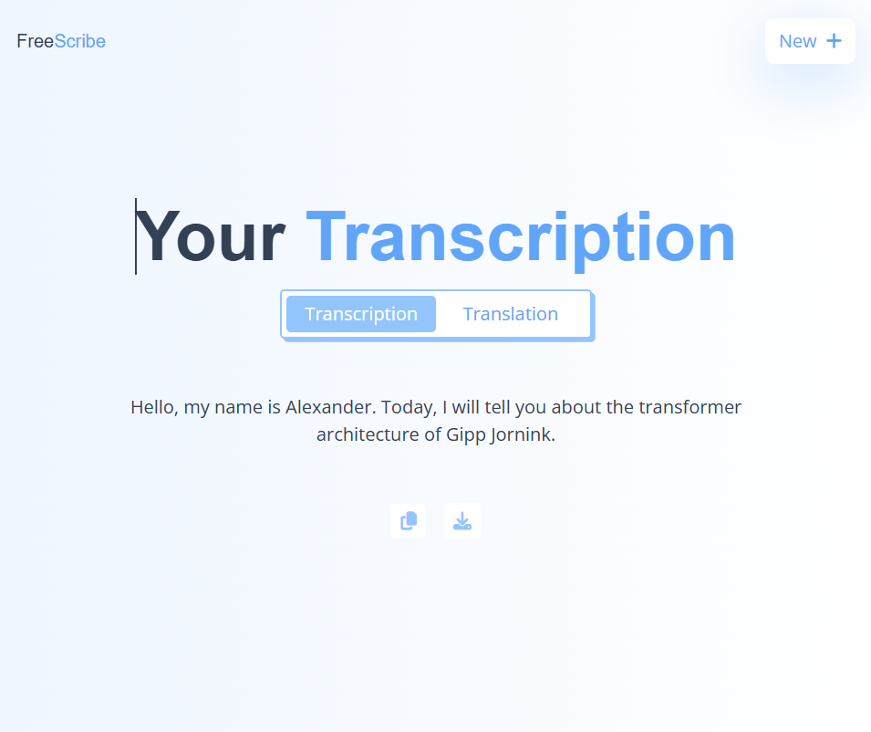
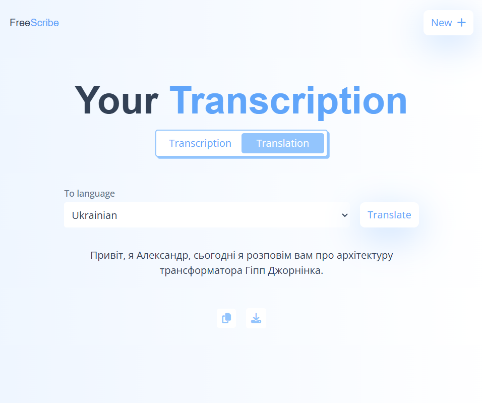

# 📘 Вебдодаток для розпізнавання, транскрибування та перекладу мовлення

## 👤 Автор

- **ПІБ**: Лях Олександр Романович
- **Група**: ФЕІ-42
- **Керівник**: ас. Ляшкевич Марія
- **Дата виконання**: [28.05.2025]

---

## 📌 Загальна інформація

- **Тип проєкту**: Вебсайт  
- **Мова програмування**: JavaScript  
- **Фреймворки / Бібліотеки**: [React](https://reactjs.org/), [@xenova/transformers](https://www.npmjs.com/package/@xenova/transformers), [Tailwind CSS](https://tailwindcss.com/)

Цей проєкт є клієнтським вебдодатком, який реалізує розпізнавання та переклад мовлення за допомогою моделей трансформерів, що працюють прямо у браузері. Інтерфейс побудований на React, а основна логіка розпізнавання реалізована з використанням бібліотеки @xenova/transformers, яка дозволяє запускати моделі машинного навчання без потреби в серверній частині.

---

## 🧠 Опис функціоналу

- 🎙️ Розпізнавання мовлення в реальному часі за допомогою моделі Whisper
- 📝 Автоматичне транскрибування голосу у текст прямо в браузері
- 🌍 Можливість перекладу транскрибованого тексту іншими мовами
- 📤 Завантаження аудіофайлів або використання мікрофона
- 🧠 Робота моделей без інтернет-запитів — усе виконується локально
- 💡 Простий та інтуїтивно зрозумілий інтерфейс на React
- 🎨 Адаптивний дизайн з використанням TailwindCSS

---

## 🧱 Опис основних класів / файлів

| Файл / Компонент             | Призначення |
|-----------------------------|-------------|
| `src/main.jsx`              | Точка входу програми, ініціалізація React-додатку |
| `src/App.jsx`               | Головний компонент додатку, маршрутизація та структура |
| `src/components/HomePage.jsx`           | Головна сторінка додатку з інтерфейсом для транскрипції |
| `src/components/Header.jsx`        | Компонент шапки сайту з назвою та навігацією |
| `src/components/Transcribing.jsx` | Компонент для транскрибування мовлення за допомогою моделі Whisper |
| `src/components/Translation.jsx` | Компонент для перекладу тексту |
| `src/components/FileDisplay.jsx`   | Компонент для відображення транскрибованого або перекладеного файлу |
| `src/utils/whisper.worker.js`     | Web Worker для запуску моделі Whisper у фоновому потоці |
| `src/utils/translate.worker.js` | Web Worker для асинхронного перекладу тексту |
| `src/index.css`      | Підключення TailwindCSS та базові стилі |

---

## ▶️ Як запустити проєкт "з нуля"

### 1. Встановлення інструментів

- [Node.js](https://nodejs.org/) v18 або новіше (рекомендовано LTS)
- npm (входить до складу Node.js)

### 2. Клонування репозиторію

```bash
git clone https://github.com/OleksaUni/diplomeProject
cd free-scribe
```

### 3. Встановлення залежностей
```bash
npm install
```

### 4. Запуск проекту в режимі розробки
```bash
npm run dev
```
Додаток буде доступний за адресою:
http://localhost:5173

### 5. Побудова проєкту для продакшну (опційно)
```bash
npm run build
```

### 6. Перегляд зібраного проєкту
```bash
npm run preview
```

## 🖱️ Інструкція для користувача

1. **Головна сторінка**:
   - Відображає назву додатку та короткий опис.
   - Кнопки для завантаження аудіофайлу або запуску мікрофона.

2. **Запис голосу**:
   - Натисніть кнопку 🎙️ `Record`, щоб активувати мікрофон.
   - Натисніть ⏹️ `Stop recording`, щоб завершити.
   - Після цього натисніть кнопку `Transcribe`, щоб отримати результат.
   - Текст автоматично зʼявиться після обробки (транскрипції).

3. **Завантаження файлу**:
   - Натисніть кнопку 📁 `upload`, щоб обрати аудіофайл з вашого компʼютера.
   - Після обробки зʼявиться текстова транскрипція.

4. **Переклад тексту**:
   - Оберіть мову перекладу зі списку (наприклад, українська, англійська, іспанська тощо).
   - Натисніть кнопку `Translate`, щоб побачити результат перекладу.

5. **Взаємодія з текстом**:
   - Ви можете скопіювати транскрибований або перекладений текст.
   - Також можна зберегти текст у форматі .txt.

---

## 📷 Приклади / скриншоти

### 🏠 Головна сторінка


### ✍️ Транскрипція


### 🌍 Переклад


## 🧪 Проблеми і рішення

| Проблема              | Рішення                            |
|----------------------|------------------------------------|
| Pipeline не було належним чином ініціалізовано. | Перевірити працездатність в інших браузерах, використати вікно анонімного перегляду. |

## 📚 Використані джерела та література

- [React Documentation](https://reactjs.org/) — офіційна документація по React
- [Vite Documentation](https://vitejs.dev/) — офіційна документація по Vite
- [Tailwind CSS Documentation](https://tailwindcss.com/docs) — документація по CSS-фреймворку Tailwind
- [Xenova Transformers](https://huggingface.co/docs/transformers.js/index) — бібліотека для запуску моделей трансформерів у браузері
- [MDN Web Docs](https://developer.mozilla.org/) — довідник з HTML, CSS, JavaScript та Web API
- [Introducing Whisper](https://openai.com/index/whisper/) — офіційний сайт Whisper  

> Усі згадані ресурси використовувались для реалізації, налагодження та дослідження функціоналу вебдодатку.
